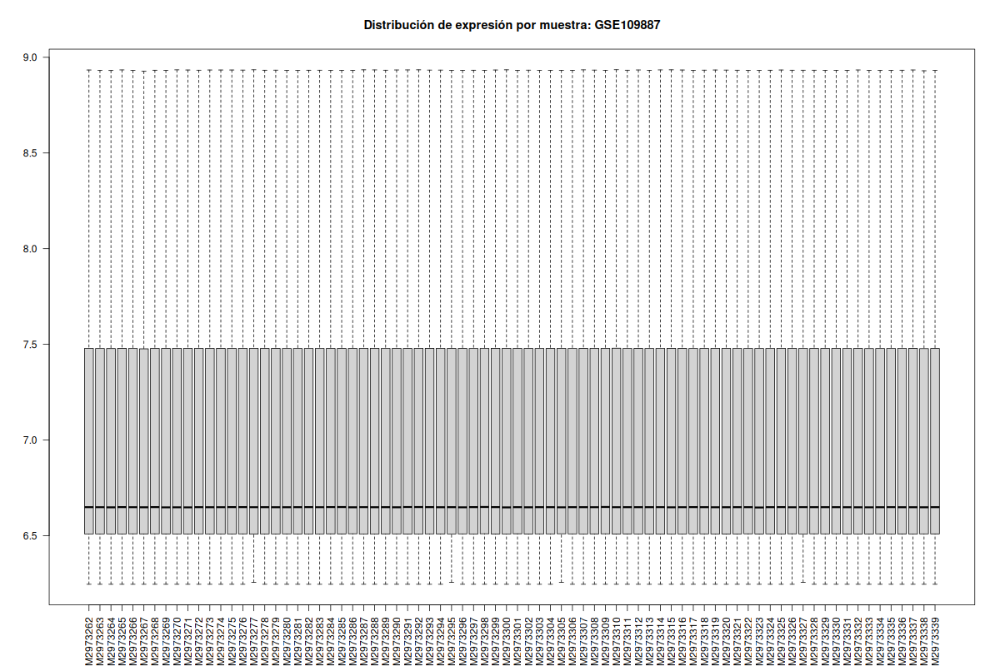
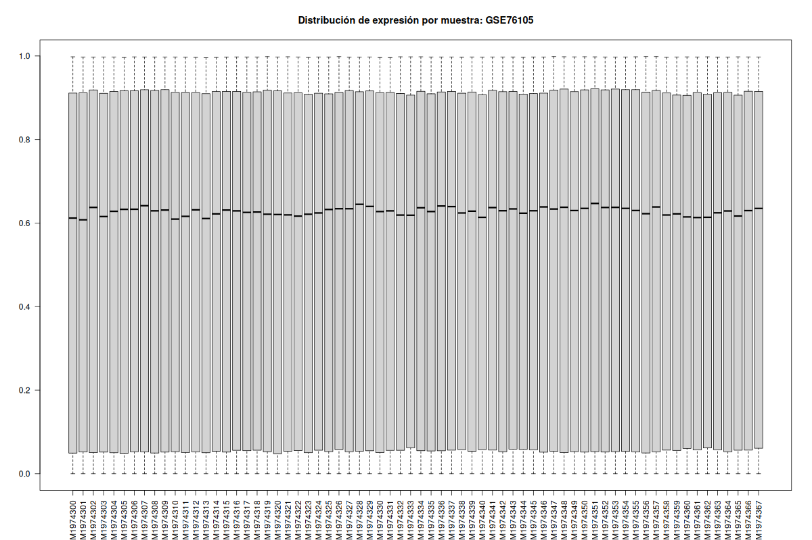
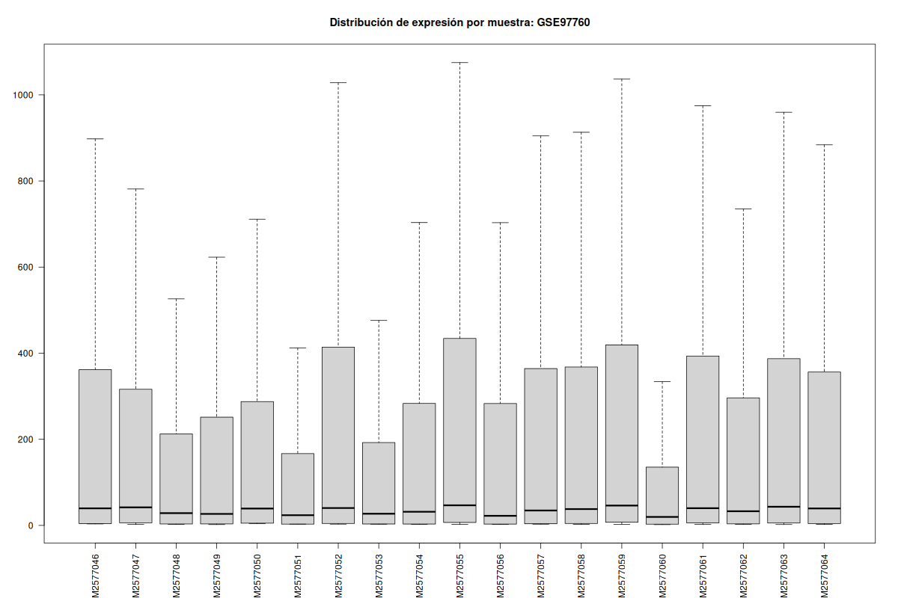
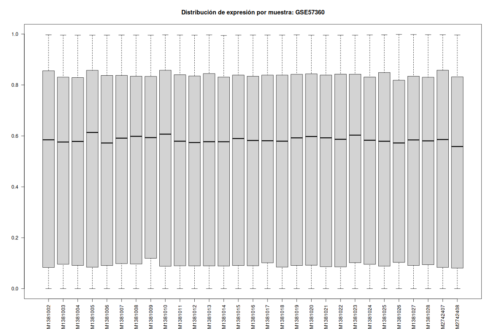
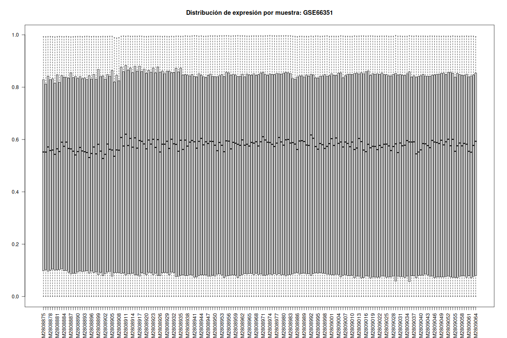
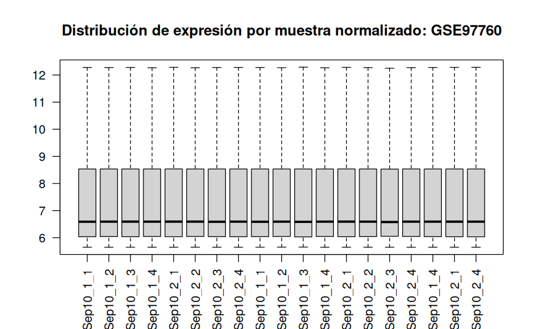
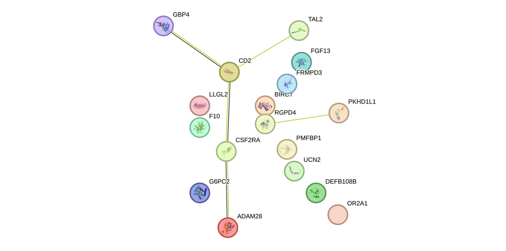

# Meta-análisis de estudios de metilación en la enfermedad de Alzheimer

# Descripción del estudio

La enfermedad del Alzheimer constituye uno de los principales desafíos en la salud
pública mundial debido a su alta prevalencia y progresiva pérdida cognitiva, así como la
falta de tratamientos completamente eficaces. La metilación del DNA juega un rol crítico
en el envejecimiento cerebral y por ende en la susceptibilidad de padecer a enfermedad
del Alzheimer [1]. Aunque se conocen varios genes de riesgos y variantes genómicas
asociadas estos solo explican parcialmente tanto el inicio como la progresión de la
enfermedad, por ello otros factores epigenéticos como la metilación del DNA juegan un
papel clave en como los genes y el ambiente interactúan para inciar o acelerar el deterioro
neuronal.

Estudios recientes han detectado diferencias de metilación entre tejido cerebral y
muestras de control, además de detectar regiones diferenciales y variabilidad de
metilación en células del sistema inmune [2]. Un meta-análisis permite integrar
hallazgos obtenidos en datasets para identificar de esta manera firmas epigenéticas
asociadas lo que podría mejorar tanto la comprensión de la patogenia como el posible uso
de biomarcadores y sugerir nuevas vías terapéuticas.

Este estudio se realizó partir de 5 datasets disponibles en el repositorio de GEO
con los siguientes números de identificador: GSE109887, GSE76105, GSE97760,
GSE57360, GSE66351. Todos pertenecen a estudios realizados mediante la tecnología
de microarrays y metilación : Illumina y Agilent. 
Se realizó con *limma* el análisis de expresión diferencial entre muestras de sujetos
sanos y enfermos (**controles** y **AD**) para posteriormente realizar el meta-análisis
de los estudios antes mencionados utilizando la librería *metafor*. Finalmente se realizó
un análisis funcional de los genes resultantes para asociarlos a sus términos GO y 
darles su correlación biológica. 

# Procesamiento de datos 

## Descarga de datasets

```{r warning=FALSE, message=FALSE}

library(GEOquery)
library(Biobase)
library(limma)
library(ggplot2)
library(dplyr)
library(IlluminaHumanMethylation450kanno.ilmn12.hg19)
library(metafor)
library(org.Hs.eg.db)
library(clusterProfiler)
library(DT)

```

Los datasets fueron descargados directamente desde R utilizando `GEOquery` y accediendo a 
los mismos mediante su código de identificación correspondiente. Se utilizaron los datos normalizados
de los estudios para realizar la posterior exploración.

```{r eval=FALSE, echo=TRUE}

options(timeout = 600)

geo_ids <- c("GSE109887", "GSE76105", "GSE97760", "GSE57360", "GSE66351")

for (id in geo_ids){
  message("Descargando:", id)
  gset <- getGEO(id, GSEMatrix = TRUE)
  
  saveRDS(gset, file = file.path("~/Documentos/Master/Estudios_InSilico/GeoData", paste0(id, ".rds")))
  message("Guardado: ", id)
}

```


## Exploración de datos 

Los datasets provienen de la tecnología de Microarrays, inicialmente se exploran los datasets para determinar sus metadatos y parametros de estudio, de esta manera se escogerá una estrategia idónea en el análisis diferencial de cada uno de ellos. Además se evalúa la heterogeneidad de los datos
para proceder con el análisis.

```{r, eval=FALSE}

dataDir <- "/home/kareng/Documentos/Master/Estudios_InSilico/GeoData/"
GSE109887 <- readRDS(file.path(dataDir,"GSE109887.rds"))
GSE76105 <- readRDS(file.path(dataDir,"GSE76105.rds"))
GSE97760 <- readRDS(file.path(dataDir,"GSE97760.rds"))
GSE57360 <- readRDS(file.path(dataDir,"GSE57360.rds"))
GSE66351 <- readRDS(file.path(dataDir,"GSE66351.rds"))

```

```{r eval=FALSE}

# Datos: GSE109887

GSE109887_eset <- GSE109887[[1]]
class(GSE109887_eset)
dim(GSE109887_eset)
pData(GSE109887_eset) 
fData(GSE109887_eset)

# Datos : GSE76105

GSE76105_eset <- GSE76105[[1]]
dim(GSE76105_eset)
pData(GSE76105_eset)
featureNames(GSE76105_eset)

# Datos : GSE97760

GSE97760_eset <- GSE97760[[1]]
dim(GSE97760_eset)
pData(GSE97760_eset)

# Datos : GSE57360

GSE57360_eset <- GSE57360[[1]]
dim(GSE57360_eset)
pData(GSE57360_eset)

# Datos : GSE66351

GSE66351_eset <- GSE66351[[1]]
dim(GSE66351_eset)
pData(GSE66351_eset)

```

Se realizaron varios boxplots obteniendo los siguientes resultados:

```{r, eval=FALSE, echo=FALSE}

#Análisis exploratorio previo 

#BOXPLOTS
# GSE109887
png("GSE109887_boxplot.png", width=1200, height=800)
boxplot(exprs(GSE109887_eset), outline=FALSE, las=2,
        main="Distribución de expresión por muestra: GSE109887")
dev.off()

# GSE76105
png("GSE76105_boxplot.png", width=1200, height=800)
boxplot(exprs(GSE76105_eset), outline=FALSE, las=2,
        main="Distribución de expresión por muestra: GSE76105")
dev.off()

# GSE97760
png("GSE97760_boxplot.png", width=1200, height=800)
boxplot(exprs(GSE97760_eset), outline=FALSE, las=2,
        main="Distribución de expresión por muestra: GSE97760")
dev.off()

# GSE57360
png("GSE57360_boxplot.png", width=1200, height=800)
boxplot(exprs(GSE57360_eset), outline=FALSE, las=2,
        main="Distribución de expresión por muestra: GSE57360")
dev.off()

# GSE66351
png("GSE66351_boxplot.png", width=1200, height=800)
boxplot(exprs(GSE66351_eset), outline=FALSE, las=2,
        main="Distribución de expresión por muestra: GSE66351")
dev.off()


```

### Boxplots {.tabset}

#### GSE109887


#### GSE76105


#### GSE97760


#### GSE57360


#### GSE66351


---

Los resultados muestran que la mayoría de los estudios están correctamente normalizados (los boxplots son homogéneos y no presentan valores atípicos). Sin embargo, el dataset con ID GSE97760 exhibe una alta heterogeneidad por lo que fue necesario normalizarlo nuevamente a partir de la descarga de los  datos crudos del mismo estudio. 

## Normalización de 97760

```{r, eval=FALSE}

untar("GSE97760_RAW.tar", exdir = "GSE97760_IDATs")
files_GSE97760 <- list.files("GSE97760_IDATs", pattern="gz$", full.names = TRUE)
sapply(files_GSE97760, R.utils::gunzip)

txt <- list.files("GSE97760_IDATs", pattern="\\.txt$", full.names=TRUE)
Agilent_inf <- read.maimages(txt, source="agilent", green.only=TRUE)

```
La plataforma utilizada en el estudio fue Agilent-039494 SurePrint G3 Human GE v2 8x60K Microarray 039381 (versión Feature Number). La normalización se llevó a cabo realizando primero la corrección de fondo a partir de los archivos .txt que contenían la intensidad de las sondas. Posteriormente, se aplicó la normalización por cuantiles y se reconstruyó el ExpressionSet para trabajar con los datos.

```{r, eval=FALSE}

#Corrección de fondo 
GSE97760_bc <- backgroundCorrect(Agilent_inf, method="normexp", offset=50)

#Normalización por método de quantiles
GSE97760_norm <- normalizeBetweenArrays(GSE97760_bc, method="quantile")

exprs_norm <- GSE97760_norm$E
exprs_set_GSE97760 <- ExpressionSet(assayData = exprs_norm)

#Boxplot

png("GSE97760_Norm_boxplot.png", width=1200, height=800)
boxplot(exprs(exprs_set_GSE97760), outline=FALSE, las=2,
        main="Distribución de expresión por muestra normalizado: GSE97760")
dev.off()

```

#### Boxplot GSE97760 normalizado 


El gráfico resultante indica que la normalización fue efectiva, ya que los datos ahora son homogéneos y no presentan valores atípicos.

Además se añadieron los datos fenotípicos y metadatos del estudio al nuevo ExpressiónSet. 

```{r, eval=FALSE}

#Creación de los datos fenotípicos en el nuevo expression set normalizado
pData(exprs_set_GSE97760) <- pData(GSE97760_eset)

#Creación de los metadatos en el nuevo expression set normalizado 
fData(exprs_set_GSE97760) <- fData(GSE97760_eset)

#Guardar el archivo RDS
saveRDS(exprs_set_GSE97760, "GSE97760_eset_norm.rds")

```

## Análisis diferencial de cada dataset 

Para cada dataset, se realizó un análisis de expresión diferencial mediante `limma` con el objetivo de identificar genes cuya expresión difiera entre los grupos de interés (casos vs. controles). Primero, se definieron los grupos experimentales y se estableció el grupo de referencia, que en estos casos será el control. A continuación, se ajustó un modelo lineal a los datos de expresión mediante la función lmFit y se aplicó el enfoque de moderación de Bayes (eBayes) para mejorar la estimación de la varianza.

A diferencia de un análisis individual, en este paso no se filtran los genes por significancia, ya que el objetivo es generar tablas completas de resultados para todos los genes, que luego se integrarán en el meta-análisis. Esto permite combinar la información de todos los estudios de manera consistente y aplicar los criterios de selección de genes diferencialmente expresados de forma conjunta. Finalmente, se creó una tabla de resultados con **logFC, estadístico t, valores p y ajustados, estadístico B y error estándar**, lista para su exportación y posterior uso en el meta-análisis.

```{r, echo=FALSE}

dataDir <- "/home/kareng/Documentos/Master/Estudios_InSilico/GeoData/"
GSE109887 <- readRDS(file.path(dataDir,"GSE109887.rds"))
GSE76105 <- readRDS(file.path(dataDir,"GSE76105.rds"))
GSE97760 <- readRDS(file.path(dataDir,"GSE97760_eset_norm.rds"))
GSE57360 <- readRDS(file.path(dataDir,"GSE57360.rds"))
GSE66351 <- readRDS(file.path(dataDir,"GSE66351.rds"))

GSE109887_eset <- GSE109887[[1]]
GSE76105_eset <- GSE76105[[1]]
GSE97760_eset <- GSE97760[[1]]
GSE57360_eset <- GSE57360[[1]]
GSE66351_eset <- GSE66351[[1]]

```

```{r}

#Análisis diferencial de GSE109887

pData(GSE109887_eset)$diagnosis <- as.factor(pData(GSE109887_eset)[, "disease state:ch1"])
pData(GSE109887_eset)$diagnosis <- relevel(pData(GSE109887_eset)$diagnosis, ref = "Control")

grupo <- pData(GSE109887_eset)$diagnosis
diseño_GSE109887 <- model.matrix(~ grupo)

exprs_GSE109887 <- exprs(GSE109887_eset)
fit1 <- lmFit(exprs_GSE109887, diseño_GSE109887)
fit1 <- eBayes(fit1)
res_GSE109887 <- topTable(fit1, coef = "grupoAD", number = Inf)

#Creación de tabla para meta-análisis

res_GSE109887$Gene <- rownames(res_GSE109887)
meta_table_G1 <- res_GSE109887[, c("Gene", "logFC", "t", "P.Value", "adj.P.Val", "B")]
meta_table_G1$SE <- with(meta_table_G1, ifelse(t == 0, NA, logFC / t))
meta_table_G1$study <- "GSE109887"

#Guardar la tabla para comparación 
write.csv(meta_table_G1, "GSE109887_metatable.csv", row.names = FALSE)

```

```{r}

#Análisis diferencial de GSE76105

pData(GSE76105_eset)$diagnosis <- as.factor(pData(GSE76105_eset)[, "characteristics_ch1.1"])
pData(GSE76105_eset)$diagnosis <- recode(pData(GSE76105_eset)$diagnosis, 
                                         "disease: Alzheimers Disease" = "AD",
                                         "disease: Control" = "Control")
pData(GSE76105_eset)$diagnosis <- relevel(pData(GSE76105_eset)$diagnosis, ref = "Control")


grupo <- pData(GSE76105_eset)$diagnosis
diseño_GSE76105 <- model.matrix(~grupo)

fit2 <- lmFit(exprs(GSE76105_eset), diseño_GSE76105)
fit2 <- eBayes(fit2)
res_GSE76105 <- topTable(fit2, coef = "grupoAD", number = Inf)

#Mapear CpGs a genes con la anotación de Illumina 

annotation <- getAnnotation(IlluminaHumanMethylation450kanno.ilmn12.hg19)
cpgs <- rownames(res_GSE76105)
genes <- annotation[match(cpgs, annotation$Name), "UCSC_RefGene_Name"]
genes_final <- ifelse(genes == "" | is.na(genes), cpgs, genes)
genes_final <- sapply(genes_final, function(x){
  if(grepl(";", x)) {
    return(unique(unlist(strsplit(x, ";")))[1])  # tomar el primer gen único
  } else {
    return(x)
  }
})

res_GSE76105$Gene <- genes_final

#Creación de tablas para el meta-análisis 

res_GSE76105$Gene <- rownames(res_GSE76105)
meta_table_G2 <- res_GSE76105[, c("Gene", "logFC", "t", "P.Value", "adj.P.Val", "B")]
meta_table_G2$SE <- with(meta_table_G2, ifelse(t == 0, NA, logFC / t))
meta_table_G2$study <- "GSE76105"

# Guardar la tabla para comparación
write.csv(meta_table_G2, "GSE76105_metatable.csv", row.names = FALSE)

```


```{r, warning=FALSE}

#Análisis diferencial de GSE57360

pData(GSE57360_eset)$diagnosis <- as.factor(pData(GSE57360_eset)[, "characteristics_ch1"])
pData(GSE57360_eset)$diagnosis <- recode(pData(GSE57360_eset)$diagnosis, 
                                         "condition: Alzheimer Disease" = "AD",
                                         "condition: Alzheimer's disease" = "AD",
                                         "condition: Down Syndrome with Alzheimer's disease" = "AD",
                                         "condition: Control" = "Control")

keep <- pData(GSE57360_eset)$diagnosis %in% c("AD", "Control")
GSE57360_eset <- GSE57360_eset[, keep]
pData(GSE57360_eset)$diagnosis <- droplevels(pData(GSE57360_eset)$diagnosis)
pData(GSE57360_eset)$diagnosis <- relevel(pData(GSE57360_eset)$diagnosis,ref = "Control")

grupo <- pData(GSE57360_eset)$diagnosis 
diseño_GSE57360 <- model.matrix(~grupo)
fit3 <- lmFit(exprs(GSE57360_eset), diseño_GSE57360)
fit3 <- eBayes(fit3)
res_GSE57360 <- topTable(fit3, coef = "grupoAD", number = Inf)

#Mapear CpGs a genes con la anotación de Illumina 

annotation <- getAnnotation(IlluminaHumanMethylation450kanno.ilmn12.hg19)
cpgs <- rownames(res_GSE57360)
genes <- annotation[match(cpgs, annotation$Name), "UCSC_RefGene_Name"]
genes_final <- ifelse(genes == "" | is.na(genes), cpgs, genes)
genes_final <- sapply(genes_final, function(x){
  if(grepl(";", x)) {
    return(unique(unlist(strsplit(x, ";")))[1])  # tomar el primer gen único
  } else {
    return(x)
  }
})

res_GSE57360$Gene <- genes_final

#Creación de tablas para el meta-análisis 
meta_table_G3 <- res_GSE57360[, c("Gene", "logFC", "t", "P.Value", "adj.P.Val", "B")]
meta_table_G3$SE <- with(meta_table_G3, ifelse(t == 0, NA, logFC / t))
meta_table_G3$study <- "GSE57360"

# Guardar la tabla para comparación
write.csv(meta_table_G3, "GSE57360_metatable.csv", row.names = FALSE)

```

```{r}

#Análisis diferencial de GSE97760
GSE97760 <- readRDS(file.path(dataDir,"GSE97760_eset_norm.rds"))

pData(GSE97760)$diagnosis <- as.factor(pData(GSE97760)[, "disease:ch1"])
pData(GSE97760)$diagnosis <- recode(pData(GSE97760)$diagnosis, 
                                         "healthy" = "Control",
                                          "advanced Alzheimer's disease" = "AD")
pData(GSE97760)$diagnosis <- relevel(pData(GSE97760)$diagnosis,ref = "Control")

grupo <- pData(GSE97760)$diagnosis
diseño_GSE97760 <- model.matrix(~grupo)
fit4 <- lmFit(exprs(GSE97760), diseño_GSE97760)
fit4 <- eBayes(fit4)
res_GSE97760 <- topTable(fit4, coef = "grupoAD", number = Inf)

#Anotación de probes de los resultados de limma
res_GSE97760$Gene <- fData(GSE97760)$GENE_SYMBOL[match(rownames(res_GSE97760), fData(GSE97760)$ID)]

#Creación de la tabla para el meta-análisis 
meta_table_G4 <- res_GSE97760[, c("Gene", "logFC", "t", "P.Value", "adj.P.Val", "B")]
meta_table_G4$SE <- with(meta_table_G4, ifelse(t == 0, NA, logFC / t))
meta_table_G4$study <- "GSE97760"

# Guardar la tabla para comparación
write.csv(meta_table_G4, "GSE97760_metatable.csv", row.names = FALSE)

```


```{r}

#Análisis diferencial GSE66351

pData(GSE66351_eset)$diagnosis <- as.factor(pData(GSE66351_eset)[, "diagnosis:ch1"])
pData(GSE66351_eset)$diagnosis <- recode(pData(GSE66351_eset)$diagnosis, 
                                         "CTRL" = "Control")
pData(GSE66351_eset)$diagnosis <- relevel(pData(GSE66351_eset)$diagnosis,ref = "Control")

grupo <- pData(GSE66351_eset)$diagnosis
diseño_GSE66351 <- model.matrix(~grupo)
fit5 <- lmFit(exprs(GSE66351_eset), diseño_GSE66351)
fit5 <- eBayes(fit5)
res_GSE66351 <- topTable(fit5, coef = "grupoAD", number = Inf)

#Mapear CpGs a genes con la anotación de Illumina 

annotation <- getAnnotation(IlluminaHumanMethylation450kanno.ilmn12.hg19)
cpgs <- rownames(res_GSE66351)
genes <- annotation[match(cpgs, annotation$Name), "UCSC_RefGene_Name"]
genes_final <- ifelse(genes == "" | is.na(genes), cpgs, genes)
genes_final <- sapply(genes_final, function(x){
  if(grepl(";", x)) {
    return(unique(unlist(strsplit(x, ";")))[1])  # tomar el primer gen único
  } else {
    return(x)
  }
})

res_GSE66351$Gene <- genes_final

#Creación de tabla para el meta-análisis 

res_GSE66351$Gene <- rownames(res_GSE66351)
meta_table_G5 <- res_GSE66351[, c("Gene", "logFC", "t", "P.Value", "adj.P.Val", "B")]
meta_table_G5$SE <- with(meta_table_G5, ifelse(t == 0, NA, logFC / t))
meta_table_G5$study <- "GSE66351"

# Guardar la tabla para comparación
write.csv(meta_table_G5, "GSE66351_metatable.csv", row.names = FALSE)

```

# Meta-análisis 

El meta-análisis tiene como objetivo integrar los resultados de múltiples estudios de expresión génica para identificar de manera robusta los genes diferencialmente expresados de forma consistente entre los datasets. Al combinar la información de todos los estudios, se mejora la potencia estadística y se reducen los sesgos específicos de cada experimento individual. El meta-análisis se realizó con la librería `metafor`.

```{r}

# Cargar tablas 
dataDir <- "/home/kareng/Documentos/Master/Estudios_InSilico/GeoData/"
table_109887 <- read.csv(file.path(dataDir, "GSE109887_metatable.csv"))
table_76105 <- read.csv(file.path(dataDir, "GSE76105_metatable.csv"))
table_97760 <- read.csv(file.path(dataDir, "GSE97760_metatable.csv"))
table_57360 <- read.csv(file.path(dataDir, "GSE57360_metatable.csv"))
table_66351 <- read.csv(file.path(dataDir, "GSE66351_metatable.csv"))

```

```{r}

#Juntar las tablas 
all_tables <- bind_rows(
  table_109887,
  table_76105,
  table_97760,
  table_57360,
  table_66351
)

#Genes únicos entre los estudios 
genes_uniques <- unique(all_tables$Gene)
length(genes_uniques)

```

El número inicial de genes obtenidos tras unir todas las tablas es 531288, un valor muy elevado porque cada plataforma de microarrays utiliza probes que no siempre tienen una correspondencia directa y única con un símbolo génico. Muchas sondas carecen de anotación, otras se asignan a múltiples genes posibles, y en algunos casos los nombres están escritos de forma inconsistente entre estudios a causa de anotaciones específicas de cada plataforma o el formato. Esto genera una gran cantidad de entradas aparentes en la columna Gene, aunque muchas de ellas no correspondan a genes humanos válidos.

Para solucionar esto, se agruparon primero los resultados por gen y estudio, promediando los valores de logFC y SE cuando una misma anotación aparece repetida dentro de un dataset. Después se limpiaeon y estandarizaron los nombres de los genes y se descartaron las entradas vacías o sin anotación. Finalmente, se filtró la tabla para conservar únicamente aquellos símbolos que coinciden con la lista oficial de genes humanos (HGNC) obtenida de la librería `org.Hs.eg.db`.

```{r}

#Función para agrupar por gen
group_by_gene <- function(df){
  df %>%
    group_by(Gene, study) %>%
    summarise(
      logFC = mean(logFC, na.rm = TRUE),
      SE    = mean(SE, na.rm = TRUE),
      .groups = "drop"
    )
}

table_109887_g <- group_by_gene(table_109887)
table_76105_g  <- group_by_gene(table_76105)
table_97760_g  <- group_by_gene(table_97760)
table_57360_g  <- group_by_gene(table_57360)
table_66351_g  <- group_by_gene(table_66351)

all_tables_grouped <- bind_rows(
  table_109887_g,
  table_76105_g,
  table_97760_g,
  table_57360_g,
  table_66351_g
)

#Limpiar los nombres de Genes 
all_tables_grouped$Gene <- toupper(trimws(all_tables_grouped$Gene))

#Filtrar los genes vacíos o NA
all_tables_grouped <- all_tables_grouped %>%
  filter(Gene != "" & !is.na(Gene))

#Alinear la tabla con la lista de genes humanos 
hgnc_symbols <- keys(org.Hs.eg.db, keytype = "SYMBOL")
all_tables_grouped <- all_tables_grouped %>%
  filter(Gene %in% hgnc_symbols)

#Lista de genes finales 

genes_final <- unique(all_tables_grouped$Gene)
length(genes_final)

```

Para realizar el meta-análisis se utilizó toda la información agrupada de las tablas de expresión génica, combinando los valores de logFC y SE de cada gen en los distintos estudios. Primero, se filtraron los genes que aparecían en al menos dos estudios, ya que un meta-análisis requiere al menos dos fuentes de información independientes para producir resultados confiables.

Para cada gen, se intentó estimar el efecto combinado mediante un modelo de efectos aleatorios utilizando el método **REML** (*Restricted Maximum Likelihood*), que permite obtener estimaciones robustas de la heterogeneidad entre estudios. En caso de que REML no convergiera, se utilizó el método alternativo **DerSimonian-Laird** (*DL*), más simple y rápido aunque menos preciso en presencia de pocos estudios.

Los resultados obtenidos incluyen el efecto combinado (*Meta_logFC*), su error estándar (*Meta_SE*), el estadístico z y p-valor (*zval y P*), la heterogeneidad entre estudios (*tau2*), el método utilizado (*REML o DL*) y el número de estudios incluidos por gen (*nStudies*). En aquellos genes en los que ambos métodos fallaron, se registraron los valores como NA y se marcó el método como FAILED.

Finalmente, todos los resultados se consolidaron en una tabla única (meta_results_df) que permite identificar los genes diferencialmente expresados de forma consistente entre los estudios y evaluar la confiabilidad de los resultados según la heterogeneidad y el número de estudios disponibles.

```{r warning=FALSE, message=FALSE}

meta_results <- list()

for(g in genes_final){

  gene_data <- all_tables_grouped %>% filter(Gene == g)

  # Si el gen aparece en menos de 2 estudios no se considera
  if(nrow(gene_data) < 2){
    meta_results[[g]] <- data.frame(
      Gene = g,
      Meta_logFC = NA,
      Meta_SE    = NA,
      zval       = NA,
      P          = NA,
      tau2       = NA,
      I2         = NA,
      Q          = NA,
      Q_pvalue   = NA,
      method     = NA,
      nStudies   = nrow(gene_data)
    )
    next
  }

  # Intentar REML 
  try1 <- try(rma(yi = logFC, sei = SE, data = gene_data, method="REML"), silent=TRUE)

  if(!inherits(try1, "try-error")){
    res <- try1
    meta_results[[g]] <- data.frame(
      Gene       = g,
      Meta_logFC = res$beta,
      Meta_SE    = res$se,
      zval       = res$zval,
      P          = res$pval,
      tau2       = res$tau2,
      I2         = res$I2,
      Q          = res$QE,
      Q_pvalue   = res$QEp,
      method     = "REML",
      nStudies   = nrow(gene_data)
    )
    next
  }

  # Intentar método alterno (DL)
  try2 <- try(rma(yi = logFC, sei = SE, data = gene_data, method="DL"), silent=TRUE)

  if(!inherits(try2, "try-error")){
    res <- try2
    meta_results[[g]] <- data.frame(
      Gene       = g,
      Meta_logFC = res$beta,
      Meta_SE    = res$se,
      zval       = res$zval,
      P          = res$pval,
      tau2       = res$tau2,
      I2         = res$I2,
      Q          = res$QE,
      Q_pvalue   = res$QEp,
      method     = "DL",
      nStudies   = nrow(gene_data)
    )
    next
  }

  # Si todo falla marcar como NA
  meta_results[[g]] <- data.frame(
    Gene = g,
    Meta_logFC = NA,
    Meta_SE    = NA,
    zval       = NA,
    P          = NA,
    tau2       = NA,
    I2         = NA,
    Q          = NA,
    Q_pvalue   = NA,
    method     = "FAILED",
    nStudies   = nrow(gene_data)
  )
}

meta_results_df <- bind_rows(meta_results)

```

```{r}

meta_clean <- meta_results_df %>%
  filter(!is.na(Meta_logFC) & !is.na(Meta_SE))

meta_clean$adjP <- p.adjust(meta_clean$P, method = "BH")
sum(meta_clean$adjP < 0.1)

```


```{r, warning=FALSE}

ggplot(meta_clean, aes(x = Meta_logFC, y = -log10(P))) +
  geom_point(alpha = 0.4) +
  geom_vline(xintercept = c(-1, 1), linetype="dashed", color="red") +
  geom_hline(yintercept = -log10(0.05), linetype="dashed", color="blue") +
  theme_bw() +
  labs(
    title = "Volcano Plot Meta-Análisis",
    x = "Meta Log2 Fold Change",
    y = "-log10(p-value)"
  )


```

El plot resultante combina dos métricas clave, en el eje X Log2 Fold Change que mide la magnitud del efecto combinado a través de todos los estudios, y en el eje Y -loh10(p-value) que mide la significancia estadística del efecto combinado. Se determinaron dos umbrales: *línea azul* es el umbral de significación estadística y *líneas rojas* es el umbral de magnitud del efecto. 
Los genes considerados diferencialmente metilados de forma consistente y significativa son los que se encuentras en las regiones superiores.
En este caso, la gran mayoría de los puntos se agrupan cerca del origen lo que significa que la mayoría de los genes no muestran un cambio de metilación significativo. 
Los genes de interés son aquellos que están en la parte superior, los cuales se describirán más adelante de acuerdo a su función y relación con la enfermedad. 

## Heterogeneidad entre estudios 

Al ser estudios aleatorios los que se han escogido para el metaanálisis es importante evaluar la heterogeneidad de los mismos. Mediante el coeficiente **I²** se muestra la proporción de la variación observada que se debe a una diferencia real entre los estudios y no solamente a un error aleatorio lo cual se evalúa en un rango de 0 - 100%.

```{r, warning=FALSE}

ggplot(meta_results_df, aes(I2)) +
    geom_histogram(bins = 40) +
    theme_bw() +
    labs(title = "Distribución de I² entre genes")

```

En este caso, se puede observar que una gran proporción de genes tienen una alta heterogeneidad lo cual penaliza la significancia estadística y por esta razón hay tan pocos genes consistentes significativos entre estudios. Los Genes Robustos son aquellos pocos que logran mantener su significancia y magnitud de efecto a pesar de la variabilidad subyacente entre estudios o que y serán estos los principales candidatos biológicos para la metilación diferencial en el Alzheimer.

```{r, warning=FALSE}

ggplot(meta_results_df, aes(Meta_logFC, -log10(P), color = I2)) +
    geom_point(alpha = 0.6) +
    scale_color_gradient(low="blue", high="red") +
    theme_bw()

```

El Volcano Plot coloreado por *I²* es un resumen altamente informativo de los resultados del meta-análisis. El gráfico muestra la relación entre la magnitud del efecto y la significancia estadística además de la consistencia entre los estudios  codificado por color. 

Se observa una clara división, la gran mayoría de los genes no significativos son predominantemente de color rojo confirmando que la inconsistencia entre estudios está penalizando la significancia estadística para la mayoría de los genes. Sin embargo, los resultados son altamente consistentes en la identificación de los pocos genes que alcanzan la máxima significancia  son de color azul a morado. Esto indica que, a pesar de la alta heterogeneidad global en el set de datos el meta-análisis logró identificar un pequeño subconjunto de genes de metilación diferencial cuyo efecto es sólido y replicable entre los cinco estudios de Alzheimer que se describen más adelante.

# Análisis Funcional

Para el análisis funcional, se seleccionaron los genes significativos obtenidos del metanálisis empleando un umbral de ajuste por FDR (*adjP < 0.1*). Con esta lista se realizó un análisis de enriquecimiento de términos de Gene Ontology (GO) mediante la función `enrichGO` del paquete `clusterProfiler` con enfoque en la categoría de proceso biológico (BP).

```{r}

sig_genes_af <- meta_clean %>% filter(adjP < 0.1) %>% pull(Gene)
sig_genes_af

ego <- enrichGO(gene = sig_genes_af,
                OrgDb = org.Hs.eg.db,
                keyType = "SYMBOL",
                ont = "BP",
                pAdjustMethod = "BH",
                qvalueCutoff = 0.1)

```

Debido al número reducido de genes significativos en la lista de entrada (23), el análisis de enriquecimiento no arrojó términos GO estadísticamente significativos esto se debe a que listas pequeñas limitan la potencia del método para detectar sobre-representación de funciones biológicas, lo que explica la ausencia de resultados relevantes en esta etapa. Por este motivo se realizó otra aproximación funcional con **STRING** para obtener un análsis de red de interacción proteína-proteína obteniendo el siguiente resultado.


STRING tiene por default un valor de confianza de 0.4, sin embargo a ser una lista muy pequeña se disminuyó el nivel de confianza a 0.150 para buscar posibles interacciones. Esto significa que no son interacciones sólidas, sino posibles relaciones tentativas y STRING no puede armar una red altamente conectada y por consiguiente se observa que aparecen interacciones débiles, algunas proteínas quedan conectadas solo por text mining y se repiten los mismos pares. A pesar de la baja confianza se puede notar un patrón de conexión entre proteínas implicadas en procesos inmunes como la activación y adhesión de linfocitos T (CD2 -> CSF2RA, GBP4, TAL2). 

### Descripción individual de genes

Se realizó una búsqueda individual de cada gen significativo en la base de datos NCBI Gene para obtener información sobre su función biológica. Los resultados se organizaron y resumieron en una tabla descriptiva, incluyendo la función conocida o predicha de cada gen. Este procedimiento permitió identificar y documentar las funciones asociadas a los genes que resultaron significativos y consistentes entre los distintos estudios analizados, facilitando así la interpretación biológica de los hallazgos del metanálisis

```{r}

gene_description_table <- read.csv(file.path(dataDir, "Genes_description.csv"))
DT::datatable(gene_description_table)

```

La lista de genes obtenida se puede agrupar por su función biológica de la siguiente manera: 

**- Neuroinflamación y Respuesta Inmune** : CD2, CSF2RB, DEFB108B, y PKHD1L1. La metilación diferencial de estos podría modular la activación de la respuesta inmune cerebral los cuales son procesos clave en la neuroinflamación asociada al Alzheimer y la neurodegeneración.

**- Supervivencia Celular, Apoptosis y Matriz Extracelular** : ADAM28, BIRC7 y FGF13. La metilación puede afectar la viabilidad y el crecimiento neuronal lo cual se relaciona dorectamente con la degeneración cerebral. 

**- Señalización y Metilación** : F10, LLGL2 y TAL2. Las alteraciones en procesos de señalización pueden afectar a la regulación del desarrollo neural.

También incluye genes que no están directamente aspciados al cerebro como GRPC2 o elementos no codificantes. 


#Conclusiones

El meta-análisis combinó los resultados de cinco estudios idependientes de metilación en la enfermedad de Alzheimer utilizando un modelo de efectos aleatorios para obtener estimaciones combinadas del efecto.
Se observó una alta heterogeneidad global lo que suguirere una variabilidad significativa entre estudios debido a las poblaciones, tejidos y plataformas de análisis. A pesar de la alta heterogeneida el análisis identificó un conjunto de genes diferencialmente metilados con alta robustez y consistencia que cumplen criterios estrictos de significancia y coherencia. 
Los genes identificados pertenecen a varias vías biológicas que son fundamentales en la patogénesis del Alzheimer como la neuroprotección, neuroinflamación y respuesta inmune.
Uno de los genes significativos y consistentes fue *ADAM28*, el cual codifica glicoproteínas ancladas a la membrana que contienen un dominio de desintegrina y metaloproteasa; la metilación suguiere una regulación epigenética de la actividad proteolítica o de molulación de la matriz extracelular las cuales son cruciales en la formación de placas amiloides y plasticidad sináptica del Alzheimer [3]. 
Otro gen identificado fue *CSF2RB*, este gen es un punto de convergencia entre la patología de la barrera hematoencefálica, la neuroinflamación y la regulación epigenética. La metilacoón de este receptor es vital para la señalización de la microglia y su sobreexpresión puede ser de origen epigenético (metilación) [4]. 
Un tercer hallazgo robusto en el meta-análisis fue el gen *FGF13*, que enfatiza la importancia de la neuroprotección y la supervivencia neuronal. La metilación consistente de FGF13 es particularmente relevante dado que estudios previos han demostrado que su baja regulación se asocia con una mejora en la función sináptica, una reducción en la fosforilación de Tau y una disminución de la apoptosis en modelos de la enfermedad de Alzheimer [5]. Finalmente, la alteración en el gen F10 sugiere una modulación epigenética de los procesos vasculares en la patogénesis de la demencia, aunque el F10 es principalmente un biomarcador sanguíneo se lo puede asociar etiología de la enfermedad de Alzheimer [6].
En conclusión, este meta-análisis ha trascendido la simple identificación de genes diferencialmente metilados al validar su consistencia entre múltiples estudios utilizando un enfoque estadístico riguroso para superar la alta heterogeneidad inherente a los estudios. Los genes identificados con alta robustez proporcionan un conjunto de biomarcadores de metilación sólidamente respaldados que convergen en procesos patológicos clave: la disfunción de la barrera hematoencefálica y la neuroinflamación, el procesamiento amiloide y la supervivencia neuronal. Estos hallazgos no solo validan el papel de la metilación del ADN como un mecanismo central en la enfermedad de Alzheimer, sino que también señalan posibles nuevas dianas terapéuticas y vías de investigación para la intervención temprana.

# Referencias 

1. Wang, Z., Liu, Z., Fang, Y. et al. Training data diversity enhances the basecalling of
novel RNA modification-induced nanopore sequencing readouts. Nat Commun 16,
679 (2025). https://doi.org/10.1038/s41467-025-55974-z
2. Huo, Z., Zhu, Y., Yu, L., Yang, J., De Jager, P., Bennett, D. A., & Zhao, J. (2019).
DNA methylation variability in Alzheimer's disease. Neurobiology of aging, 76, 35–
44. https://doi.org/10.1016/j.neurobiolaging.2018.12.003
3. Howard Linda, Zheng Yufang, Horrocks Maureen, Maciewicz Rose A. and Blobel Carl(2001), Catalytic activity of ADAM28, FEBS Letters, 498, doi: 10.1016/S0014-5793(01)02506-6
4. Shang, S., Yang, Y. M., Zhang, H., Tian, L., Jiang, J. S., Dong, Y. B., Zhang, K., Li, B., Zhao, W. D., Fang, W. G., & Chen, Y. H. (2016). Intracerebral GM-CSF contributes to transendothelial monocyte migration in APP/PS1 Alzheimer's disease mice. Journal of cerebral blood flow and metabolism : official journal of the International Society of Cerebral Blood Flow and Metabolism, 36(11), 1978–1991. https://doi.org/10.1177/0271678X16660983
5. Li, R. M., Xiao, L., Zhang, T., Ren, D., & Zhu, H. (2023). Overexpression of fibroblast growth factor 13 ameliorates amyloid-β-induced neuronal damage. Neural regeneration research, 18(6), 1347–1353. https://doi.org/10.4103/1673-5374.357902
6. Yang, L., He, L., Bu, Z., Xuan, C., Yu, C., & Wu, J. (2023). Serum Protein-Based Profiles for the Diagnostic Model of Alzheimer's Disease. American journal of Alzheimer's disease and other dementias, 38, 15333175231220166. https://doi.org/10.1177/15333175231220166


